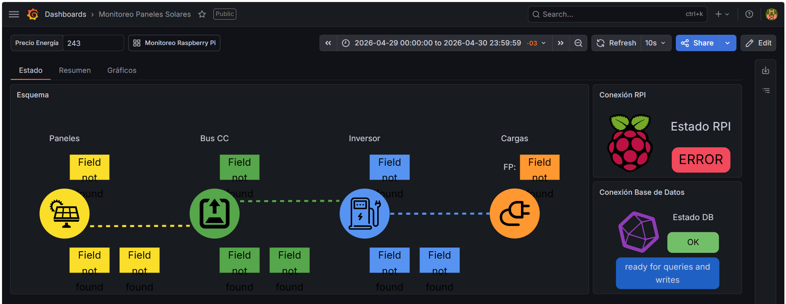
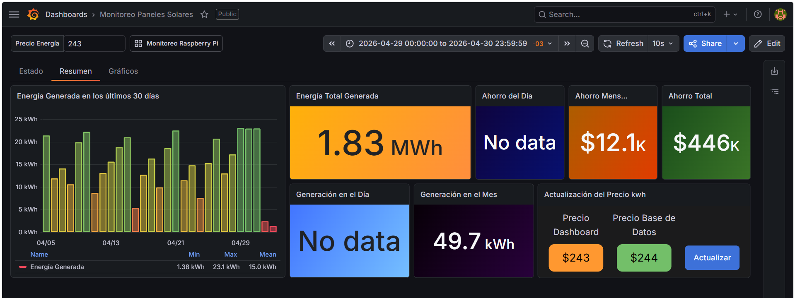
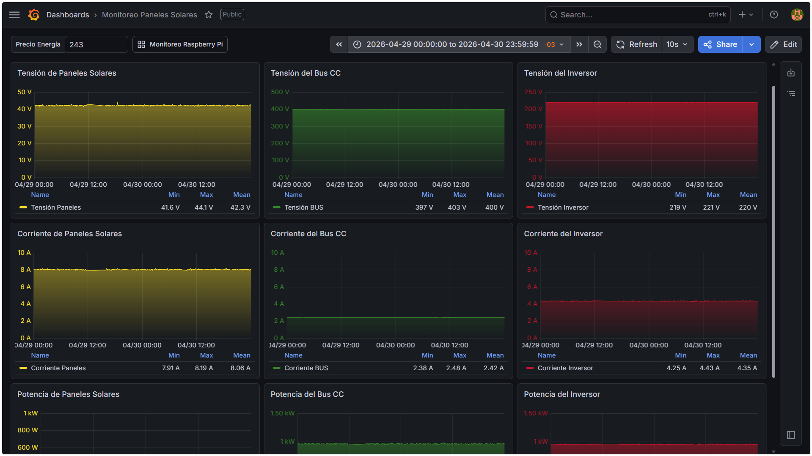
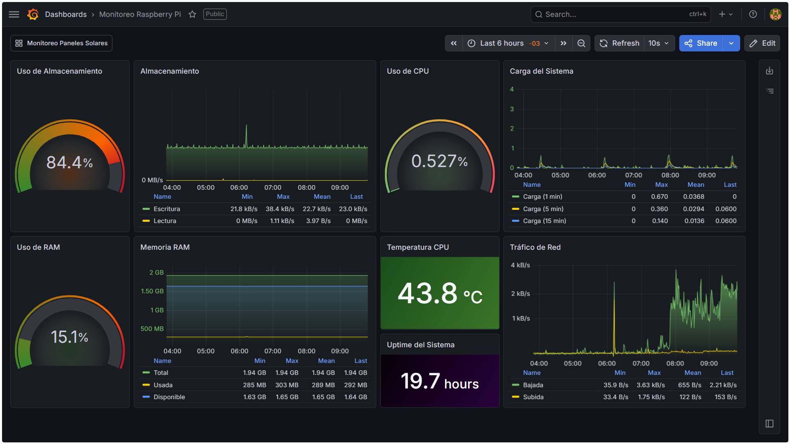

# ☀️ Monitoreo de Paneles Solares

Sistema de monitoreo de energía solar. El proyecto recolecta datos en tiempo real de un inversor mediante una Raspberry Pi. La Raspberry utiliza **Telegraf** para la recolección, procesamiento e inserción de los datos en la base de datos. Los datos recopilados son almacenados en una base de datos de series temporales **InfluxDB** y mediante ellos se generan visualizaciones en **Grafana**.

## 📊 Visualización

En esta sección se muestran las métricas del sistema y el estado de la Raspberry Pi.

### Paneles de Monitoreo

El dashboard se encuentra disponible: [Monitoreo-Solar](assets/dashboard-monitoreo.json)

#### Estado del Sistema

#### Resumen de Generación y Ahorro

#### Gráficas Temporales de las Variables Eléctricas
 

### Monitoreo de la Raspberry Pi

El dashboard se encuentra disponible: [Monitoreo-RPI](assets/dashboard-rpi.json)

## 🛠️ Tecnologías Utilizadas

*   **Infraestructura:** Docker.
*   **Base de Datos:** InfluxDB 2.x (Consultas en Flux).
*   **Visualización:** Grafana.
*   **Proxy:** SWAG.
